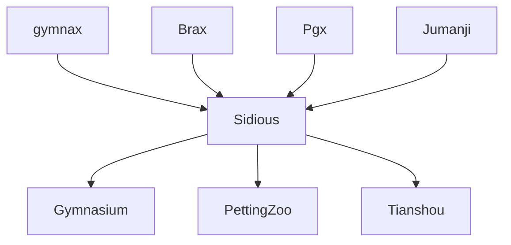

# Sidious

> Power! Unlimited power!

## Goal

- Available in Anakin architecture
- Support both single-agent and multi-agent
- Support both discrete and continuous control
- Wrap popular JAX-native RL environments
- Provide converter to popular non-JAX RL APIs

## Non-Goal

- Develop original JAX-native environments
- Provide algorithms

