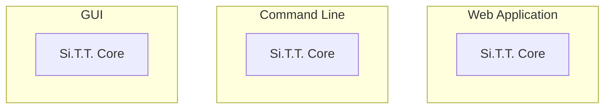
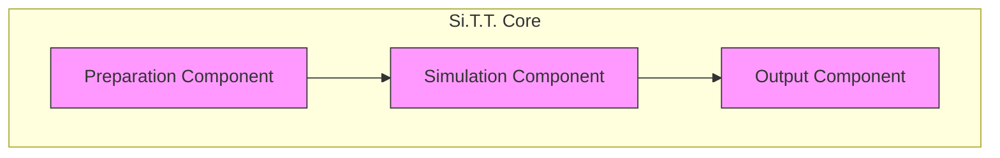
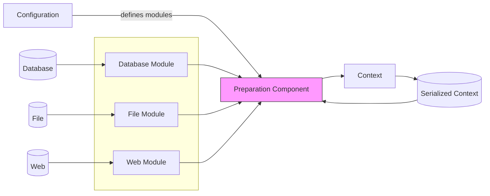
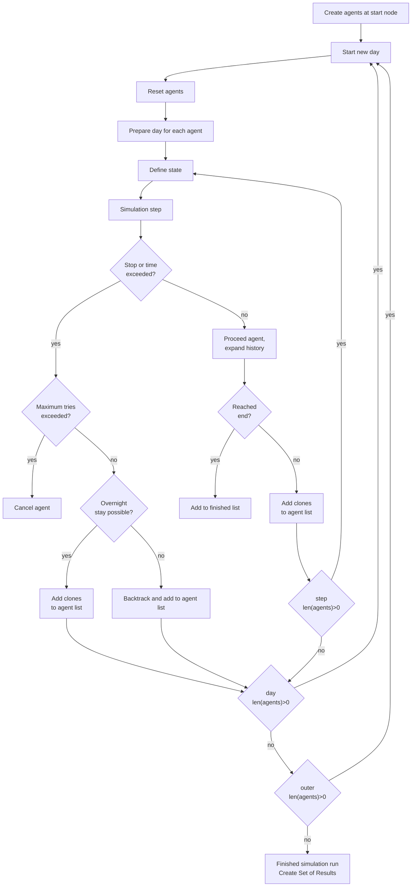
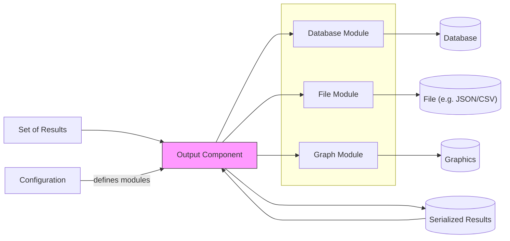

# Si.T.T. Application Concept

Si.T.T. is a program suite to simulate the traffic and transport of pre-industrial societies. It uses an agent-based
approach to model the simulation. An agent can be thought of as a batch of cargo transported through the network
(rather than an individual person travelling it).

The following sections explain the basic concepts of the Si.T.T. application. The content is subject to change.

## Modularity

Most components of Si.T.T. are modular. This means that they can be exchanged thus modifying the behavior of the
simulation. For example, the Preparation Component can handle different data sources such as databases, files,
or web sources. Modules are plain Python classes, and it is easy to create new classes.

## Si.T.T. Core

The main simulation program code is called *Si.T.T. Core*. The core takes arguments defined by some *configuration*.
After running, it returns data in a format that can be read and presented by other applications. Si.T.T. Core is designed
to be run as part of other applications, e.g. as part of a website (e.g. in a Django application), as a command line
programm or within one that presents a nice GUI (graphical user interface).



The core consists of three components:



* The **Preparation Component** consists of modules that read data from data sources and convert them into a
  format that can be read by the simulation.
    * The output of this component is called the *Context*. The context will contain static data like
      possible routes including height profiles, route type (road, stream, etc.), weather data, data on fatigue and
      whatever additional information makes sense). Some data will also exist as dynamic web endpoints.
* The **Simulation Component** runs the actual simulation. A number of virtual agents will traverse possible routes.
  An agent does not need to represent a person. In a trade network, an agent is more likely to be a load of cargo.
  They will take data from the context (read only) and create a state for each agent. Modules in the simulation will
  be called during each step of the simulation reading and modifying the state.
    * The *State* represents the current data of a particular agent within a given step of the simulation. It contains
      the time and position of the agent plus additional generic data defined by the simulation modules. Fatigue, load,
      mode of transport, and other information can be contained in the state.
    * Simulation modules are the core code blocks that define how the simulation behaves. It is easy to change and
      reorder these modules.
    * After all agents have finished, a *Set of Results* is created.
* The **Output Component** will take the set of results and will call its modules to output or present these in some
  meaningful way. Possible outputs are data written into a database, a set of graphs, or a spreadsheet.

All components are set and defined by the *Configuration*, a set of data and rules defined before running the core
which define which modules to load and what presets to assume.

The following diagram shows the basic constituents of the software:

```mermaid
flowchart TB
APP([Application])

CONF["Configuration"]
SRC[("Data Source(s)")]
OUTPUT[Output]

subgraph CORE [Si.T.T. Core]
    IN["Preparation Component"]
    subgraph SIM["Simulation Component"]
        subgraph AGENT["any number of Agents"]
            STATE["State"]
            ITER["Iteration"]
            
            STATE <-->|exchange data| ITER
            ITER -->|n times| ITER
        end
    end
    OUT["Output Component"]
    
    CONTEXT[Context]
    RESULT[Set of Results]
    
    IN -- creates --> CONTEXT -- read by --> SIM -- creates --> RESULT -- parsed by --> OUT
end

CONF -- sets --> CORE
SRC -- read into --> IN
OUT -- creates --> OUTPUT
APP -- runs --> CORE
APP -- defines --> CONF

classDef module fill:#f9f,stroke:#333,color:#333;
class IN,SIM,OUT module;
style APP fill:#5F9EA0,color:#fff;
```


## Configuration

The configuration can be defined using any of these methods:

* programmatically
* from YAML
* from command line parameters

Consequently, the configuration can be defined by another program, or running a wrapper on the command line or within
a Jupyter notebook. Core of the configuration will be config loader, probably based on either
[jsonargparse](https://jsonargparse.readthedocs.io/en/latest/) or [Click](https://click.palletsprojects.com/en/8.1.x/).


## Preparation Component

The Preparation Component's task is to fetch data from different sources and aggregate it into a context object
that is passed to the simulation. This is done by using specific modules. Each module is specialized on importing data
from a different source. New modules can easily be written in order to add new sources. All data will be collected in
the context object. The context object can also be serialized and saved to a file, so subsequent runs of the simulation
do not have to re-create the context over and over again.



The context will aggregate things like:

* means of transport
* possible routes
* landscape model
* possibly precalculated route variants (precalculation can be done using a module, too)
* weather data
* fatigue model
* presumptions such as starting place, target location, starting time, load, etc.
* precalculated routes for the simulation to check the simulation against (this is done in the preparation because we
  can then reduce the number of routes to simulate or change certain parameters)
* ... other data relevant for simulation models


## Simulation Component

This is the core worker. It will run a list of configured modules each iteration and calculate times and distances
travelled by an agent.

The simulation will expect the two context data entries to be set:

* Full graph of hubs and paths, including distances, slopes, and other relevant data.
* Directed graph of possible routes to be taken. This is the abstraction of full graph just including all routes to
  check against (see above).

The simulation contains two main data structures:

* Agent: Simulated entry travelling the paths. Agents can be split and merged by the simulation to optimize iterations.
  The agent will contain the current hub, the next hub and path to test against. It will also save a history of past
  nodes and roads travelled along with some data.
* State: Status record mostly valid for a single iteration. It is attached to an agent. The most important data
  contained is the precalculated time taken to the next hub. The state can also signal a forced stop (useful for certain
  scenarios).

The basic simulation runs like this:

* The simulation will look at the starting point and create a number of agents. The number is equal to the possible
  outgoing paths of the initial hub. 
* The simulation will start the outer loop. This loop will continue as long as there are still unfinished (and
  uncancelled) agents available.
  * The simulation will start a new day. This is the intermediate loop.
    * Each agent receives a reset. PrepareDay modules are run for each agent.
    * The inner loop will be run. This loop will run as long as there are still agents not finished this day.
      * Each agent is considered and the next possible step is precalculated. The state of each agent can be set by
        DefineState modules.
      * The actual calculation is done by SimulationStep modules.
      * After each calculation, the simulation checks if the agent can reach the next hub, if there is a forced stop, or
        if the target hub has been reached.
      * If none of the above apply, re-enter agent for the next run of the inner loop.
      * Also consider the possibility, that an agent cannot reach the next hub at all. Then cancel this agent. This is
        also the case, if an agent cannot proceed for a certain number of steps (set in configuration, default is 100).
      * If an agent has finished its day loop, then check if it can stay overnight at the current hub. If not, backtrace
        to the last possible step. This might also mean, the agent backtracks to the hub it started from today.
    * After the inner loop has finished, we have a list of agents that have finished, cancelled, or are still running.
    * We will merge running agents if they are at the same hub on the same day (subject to other status entries defined
      by modules).
    * Likewise, agents on hubs with more than one exit path will be cloned.
    * Jump back to the next day, unless there are no remaining running agents.

The following flowchart displays how the simulation core is run.



## Output Component

The output component is the opposite of the input one: It will render the set of results into some other format using
modules. Again, each module can be specialized to export specific formats or send it to specific targets. Serialization
of the plain result data is also supported, so it can be reloaded by the output component later on, too.


